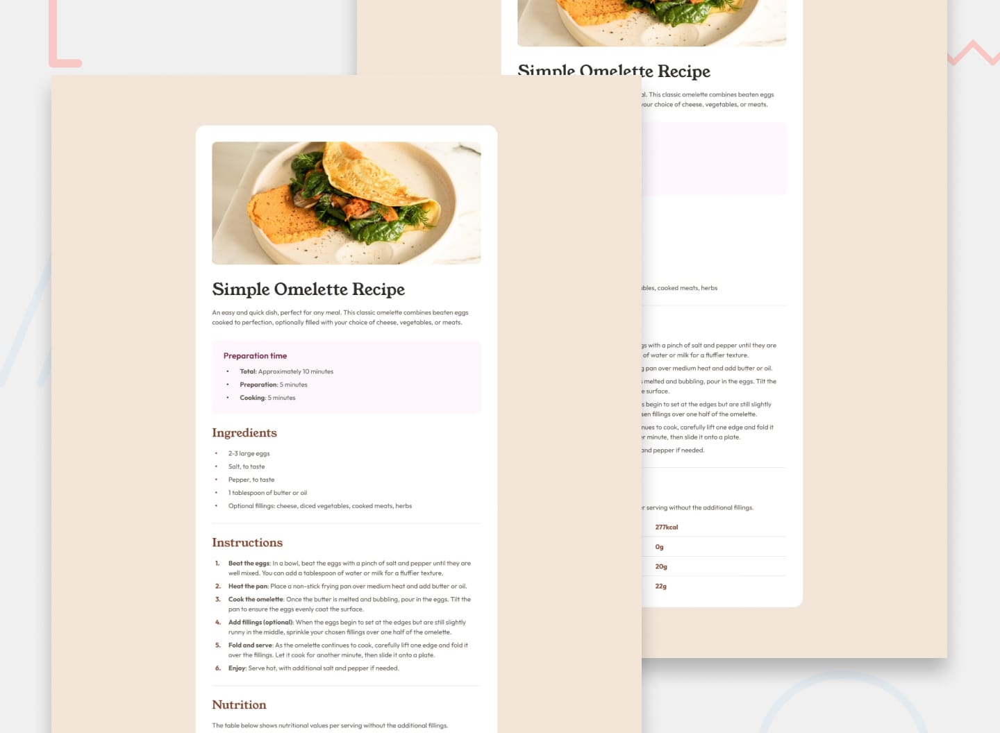

# Recipe page

A simple page, that could be part of a blog with more recipe's included. Built with HTML and CSS.

Someday I'll update this project to be a complete blog built with Astro JS.

The designs are from a frontend mentor challenge

> Frontendmentor is a platform offering, some free and paywalled professional designs for frontend developers to create stunning projects.

View my list of all solved Frontementor challenges [here](https://github.com/Av1-Lv5/Frontendmentor-challenges)
